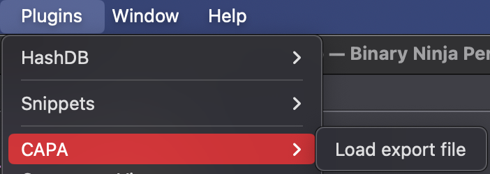
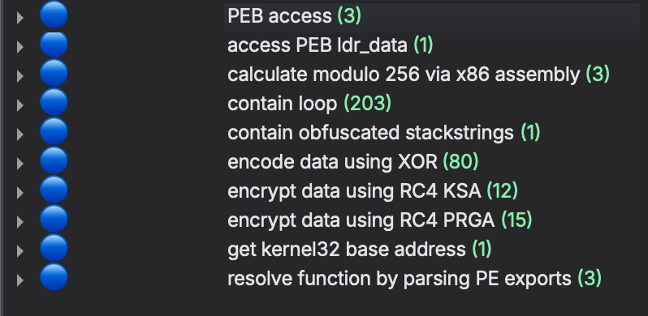

# CAPA Binja

# BinaryNinja CAPA

This plugin attempts to bring [CAPA](https://github.com/mandiant/capa) to BinaryNinja.

At the moment, it is capable of opening an json output from capa command line and import it in Binary Ninja.

## Installation

Copy (or clone) the content of this git into your plugins folder :

- macOS: `~/Library/Application Support/Binary Ninja/plugins/`
- Linux: `~/.binaryninja/plugins/`
- Windows: `%APPDATA%\Binary Ninja\plugins`

In the future, this plugin will be added to Binary Ninja’s plugin manager.

## Usage

1. You need to analyze the binary you want using CAPA cli, using verbose (—verbose) and redirecting json output to a file :

    ```bash
    capa Malwares/Pikabot/pikabot.dll --verbose -j > output.json
    ```

2. Load the binary you analyzed in Binary Ninja
3. Load the plugin by Plugins > CAPA > Load input file




1. Now every capability is tagged in the binary and you can follow it using addresses :




## Future improvements

- Be more precise where matches are located in the code, by reusing blocks like IDA script
- Find a way to run CAPA inside binja, either by launching a subprocess in the plugin running capa or understanding the library to use it directly
